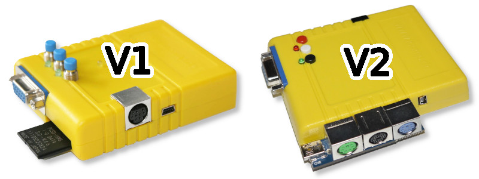

# Chameleon64-binaries
Ready-compiled FPGA cores for the Turbo Chameleon 64.

Collected, ported and curated by Alastair M. Robinson

The binaries available for download here are mostly ports of cored which originated on the MiST board. The ports were made possible by
my DeMiSTify framework, which combines a minimal CPU core with tiny but mostly MiST-compatible firmware.

The cores are sorted by type (Arcade, Console or Computer", and each one has its own ReadMe explaining a little about the core's origins,
how to use it, and any fetch-quests that might be needed to supply suitable ROMs.

Please note: There are two versions of each core - for the two different versions of the Turbo Chameleon 64 hardware. The hardware versions
are illustrated here. The easiest way to tell them apart is to look at how a PS/2 keyboard and mouse would connect:
If a PS/2 keyboard and mouse connect to a breakout cable, you have V1 hardware. If the keyboard and mouse connect directly to sockets on 
the cartridge, you have V2 hardware.

If you’d like to show your appreciation for these cores, donations are welcome at
[PayPal.me/robinsonb5](https://paypal.me/robinsonb5) or if you wish you can offer ongoing support at
[Patreon](https://patreon.com/coresforchameleon)

